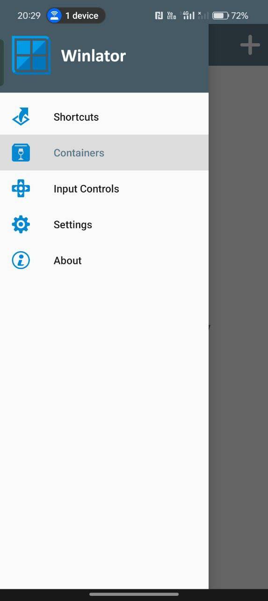
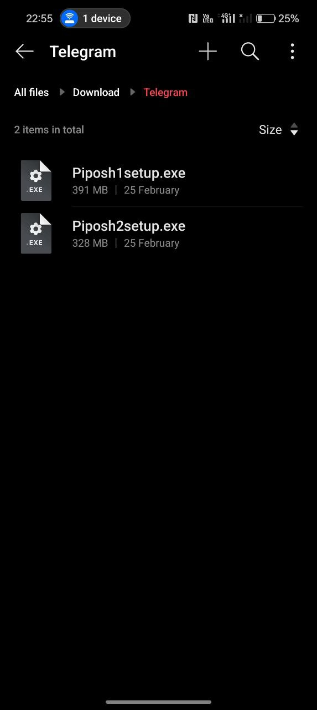
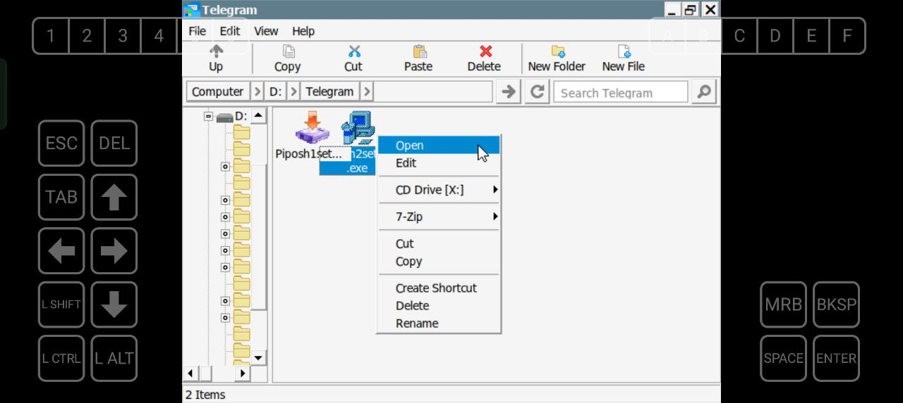
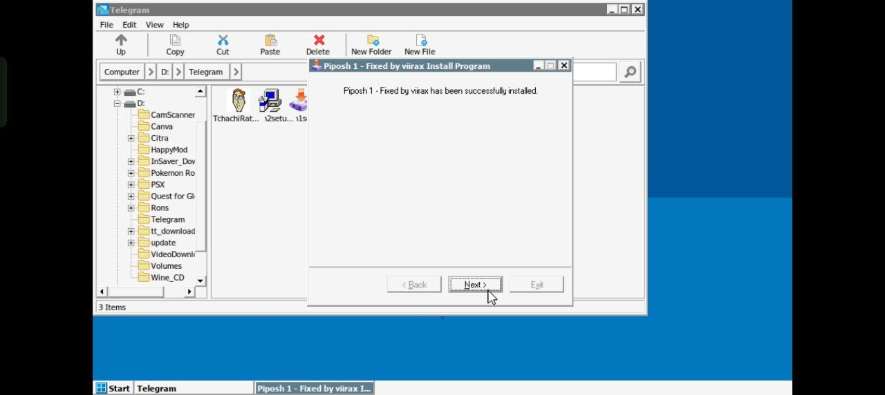
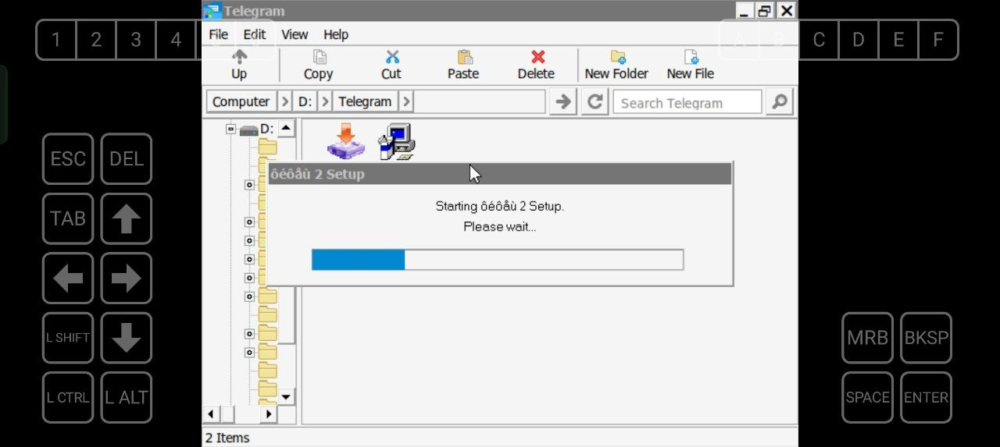
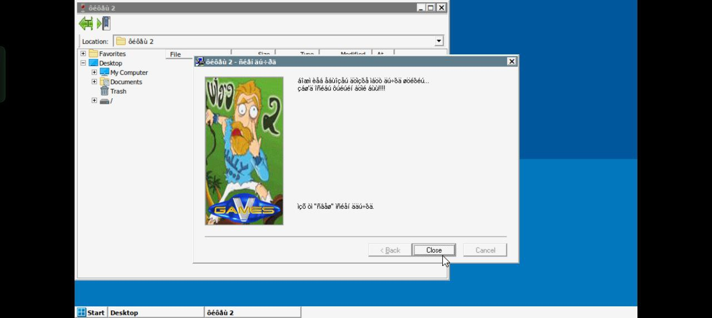
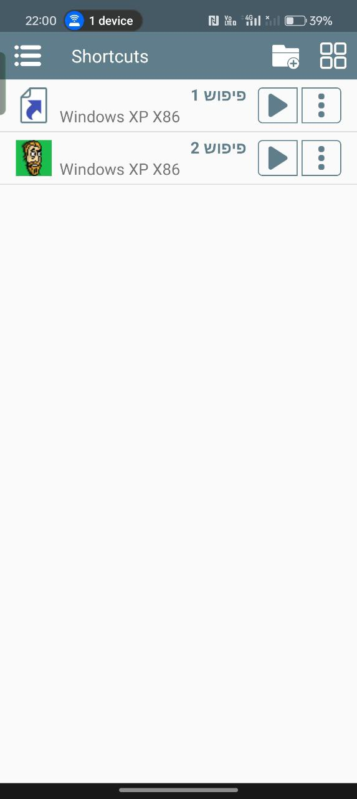

## מדריך – פיפוש 1 ו-2 באנדרואיד דרך Winlator

## שלב 1 – הורדת והתקנת Winlator

הורידו את Winlator מהקישור המצורף.

https://github.com/brunodev85/winlator/releases

התקינו את קובץ ה-APK.
אשרו התקנה ממקור לא ידוע אם צריך.
פתחו את האפליקציה

.

  

## שלב 2 – הורדת מתקיני המשחק
הורידו את מתקיני Piposh 1 ו-Piposh 2 מהקישור המצורף.
העבירו את קבצי ההתקנה לטלפון (לתיקייה כלשהי בזיכרון הפנימי).

לדוגמה:
Internal Storage > Download > Piposh

  

## שלב 3 – יצירת Container של Windows XP
במסך הראשי לחצו על Create Container.
בחרו:
Windows Version: Windows XP
Resolution: 800x600
RAM: 1024–2048MB
Graphics Driver:
Snapdragon → Turnip
אחרים → Default
DX Wrapper → WineD3D
שמרו את ה-Container.

  

## שלב 4 – התקנת המשחקים
היכנסו ל-Container.
פתחו File Explorer.
גשו לתיקייה שבה שמרתם את קובץ ההתקנה.
הפעילו את קובץ ה-setup / installer.
התקינו כרגיל כמו ב-Windows.

  

  

  

  

##  קישור להתקנת םיםוש 1 ו 2
https://archive.org/details/piposh-1setup
https://archive.org/details/piposh-2setup

## שלב 5 – הפעלה מה-Shortcut Screen
לאחר ההתקנה:
חזרו למסך הראשי של Winlator.
המשחק אמור להופיע אוטומטית במסך הקיצורים.
לחצו על האייקון כדי להפעיל.
אם לא הופיע קיצור דרך – ניתן ליצור ידנית (מוסבר בהמשך).

  

## ⚠ בעיות ידועות כרגע
בפיפוש 2 כרגע לא ניתן לשמור (אצלי לפחות).
עדיין לא נבדק האם העברת קובץ שמירה ממחשב והדבקה לתיקייה תפתור את זה.
אם מישהו מצליח לפתור — אשמח לעדכון.

## 📂 תוספות חשובות
איך להוסיף כל תיקייה ככונן (Drive)
Winlator מאפשר להגדיר תיקייה מהטלפון ככונן בתוך Windows.
ערכו את ה-Container.
גשו ל-Drives.
הוסיפו Drive חדש.
בחרו תיקייה מהטלפון.
תנו לה אות כונן (למשל D:).
עכשיו בתוך Windows היא תופיע ככונן רגיל.

(צילום מסך של הגדרת Drives)

## איך להפעיל קובץ ISO
אם יש לכם משחק כ-ISO:
היכנסו ל-Container.
פתחו את תפריט ההגדרות.
בחרו Mount ISO.
בחרו את קובץ ה-ISO מהטלפון.
הוא יופיע ככונן דיסק בתוך Windows.

## איך להעתיק משחק מותקן ממחשב וליצור קיצור דרך
אפשרות מתקדמת:
התקינו את המשחק על מחשב Windows רגיל.
העתיקו את תיקיית המשחק המותקנת.
העבירו אותה לטלפון.
הוסיפו את התיקייה כ-Drive (כמו שהוסבר למעלה).
היכנסו ל-.exe הראשי והפעילו.

## יצירת קיצור דרך ידני:
במסך הראשי של Winlator לחצו Add Shortcut.
בחרו את קובץ ה-.exe.
תנו שם ואייקון.

המשחק יופיע במסך הקיצורים.
